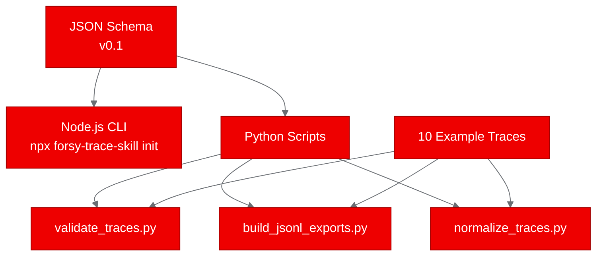

# Image Review — v1

## Scores

| Dimension | Weight | Score | Weighted |
|---|---|---|---|
| Placement rationale | 2x | 6 | 12 |
| Prompt specificity | 2x | 7 | 14 |
| Brand compliance | 2x | 8 | 16 |
| Aspect ratio & sizing | 1x | 7 | 7 |
| Alt text quality | 1x | 4 | 4 |
| Image count | 1x | 4 | 4 |
| **Weighted total** | | | **57 / 90** |
| **Normalized score** | | | **6.3 / 10** |

## Visual Inventory

| # | Type | Location | Description |
|---|---|---|---|
| 1 | Mermaid diagram (`graph LR`) | Lines 56–63, "Deploying as Kubernetes Jobs" section | Four Job nodes with CLI commands flowing to completion status nodes |

Total visuals: **1 diagram** across 133 lines and 7 sections.

## Per-Image Feedback

### 1. Kubernetes Jobs flow diagram (Mermaid, lines 56–63)

**Placement**: Well-placed directly after the sentence "We created four Jobs, one for each validation scenario." The diagram shows the four jobs in parallel with their completion times, which reinforces the text. This is the strongest visual in the post because it's the only one.

**Diagram clarity**: The `graph LR` layout is appropriate for showing parallel tasks. Node labels include both the job name and the exact command, which is useful. However, all four result nodes show "Completed in 5s" while the results table below shows "< 1s" for all scenarios. This is a factual inconsistency — the diagram should match the validation results table.

**Brand compliance**: The `%%{init}%%` block references six Red Hat brand variables:
- `primaryColor: '#EE0000'` — correct Red Hat red
- `primaryBorderColor: '#A30000'` — correct dark red
- `lineColor: '#6A6E73'` — correct neutral gray
- `secondaryColor: '#F0F0F0'` — correct light neutral
- `tertiaryColor: '#0066CC'` — correct extended blue
- `primaryTextColor: '#fff'` — white text on red background

This is solid palette coverage.

**Alt text**: No alt text or caption provided. The Mermaid code block has no mechanism for native alt text, but a caption line (e.g., `*Figure 1: Four Kubernetes Jobs executing Forsy Trace Skill validation and export scripts*`) should be added below the diagram for accessibility.

## Missing Image Opportunities

The post is significantly under-served by visuals. A 133-line technical post with code samples, a YAML manifest, and a results table would benefit from at least 3–4 visuals. Specific opportunities:

### 1. Hero image (top of post)

A hero image is expected for Red Hat Developer Blog posts. This post has none. Suggested placeholder:

```
<!-- IMAGE: Hero banner showing AI agent trace data flowing through a structured pipeline.
     Left side: tangled, unstructured agent logs (gray #6A6E73 lines).
     Right side: clean, structured trace records in labeled boxes (Red Hat red #EE0000 accents).
     Center: a funnel/filter labeled "Forsy Trace Skill".
     Background: dark (#151515) with subtle grid pattern.
     Style: flat technical illustration, no gradients, Red Hat brand palette.
     Aspect ratio: 16:9, 1200x675px minimum. -->
```

### 2. Architecture overview diagram (after "What Forsy Trace Skill does")

The text describes four components (JSON schema, Node.js CLI, Python scripts, example traces) but doesn't visualize how they relate. A Mermaid diagram would work well here:



*Figure: Forsy Trace Skill components — a JSON schema drives both the Node.js CLI installer and three Python processing scripts that operate on example trace data.*

### 3. Build and deploy pipeline diagram (before or after "Containerizing with UBI")

The post describes a multi-step process (Dockerfile creation → BuildConfig → Quay push → Job deployment) that is never visualized end-to-end. This is a natural fit for a `graph LR` Mermaid diagram:


*Figure: End-to-end pipeline from source repository to validated Kubernetes Jobs on OpenShift.*

### 4. Results summary visual (at "Validation results")

The results table is adequate but a simple visual showing "10 traces validated, 248 steps exported, 0 errors" would create a stronger visual anchor. This could be a simple Mermaid diagram or an image placeholder with key metrics displayed prominently.

## Specific Fixes Required

1. **Fix factual inconsistency in existing diagram**: The four result nodes say "Completed in 5s" but the validation results table says "< 1s" for all scenarios. Update the diagram nodes to match.

2. **Add a hero image placeholder** at the top of the post with a detailed generation prompt.

3. **Add a caption/alt text line** below the existing Mermaid diagram: `*Figure 1: Four Kubernetes Jobs executing Forsy Trace Skill's CLI, validation, export, and normalization scripts in parallel.*`

4. **Add at least one more Mermaid diagram** — the build-and-deploy pipeline (opportunity #3 above) is the highest-value addition because it visualizes the core narrative of the post.

5. **Consider adding the component architecture diagram** (opportunity #2) to strengthen the "What Forsy Trace Skill does" section.

## Summary

The post has **one Mermaid diagram** that is well-placed and correctly themed with Red Hat brand variables, but it contains a factual inconsistency with the results table. The draft is significantly under-served by visuals — a 133-line technical post covering containerization, deployment, and validation should have at least 3–4 visuals including a hero image. The existing diagram demonstrates good brand compliance practices that should be replicated in additional visuals. The most impactful additions would be a hero image and an end-to-end pipeline diagram.

**Normalized score: 6.3 / 10** — Passing but needs more visual content to match the depth of the written material.
