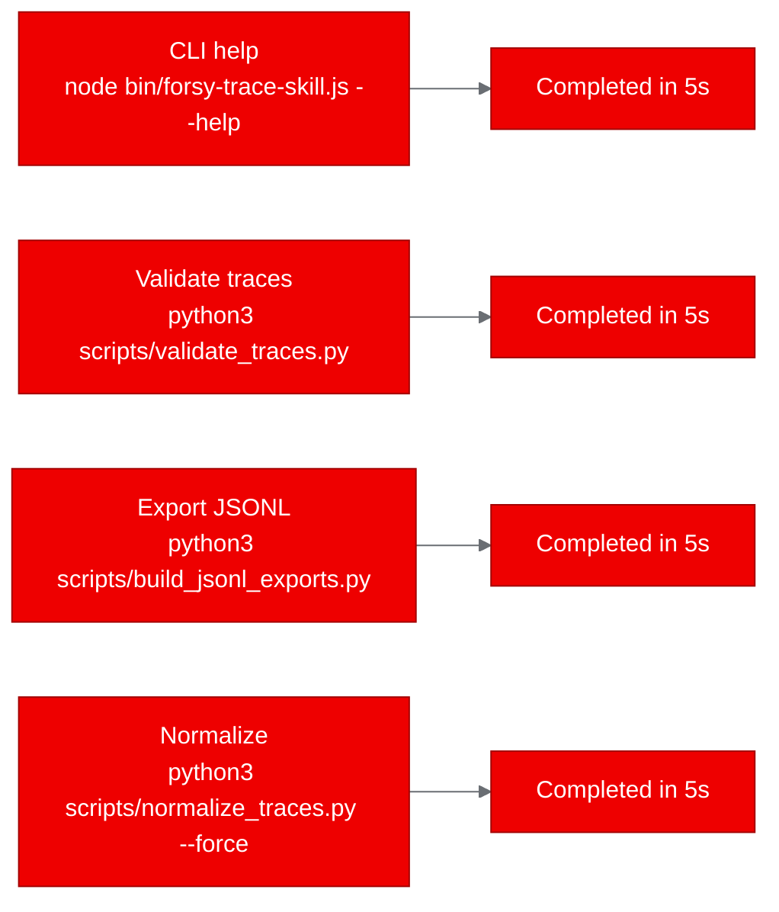

## Deploying an AI agent trace toolkit on Red Hat OpenShift AI

*How we containerized and validated Forsy Trace Skill as batch Kubernetes Jobs in under 5 minutes*

AI agents are increasingly doing complex, multi-step work: running scientific computations, drafting legal analyses, prototyping products, and coordinating tool calls across services. The final output tells you what the agent produced. It doesn't tell you what happened along the way. Which tools did it use? Where did it retry? What observations shaped its decisions? Without structured records of agent behavior, debugging and improving these systems is guesswork.

[Forsy Trace Skill](https://github.com/Forsy-AI/forsy-trace-skill) is an open-source project that addresses this gap. It provides a JSON schema and toolkit for capturing AI agent workflows as structured, annotated trajectory data. We wanted to know: can this kind of data-processing tooling run on Red Hat OpenShift AI as containerized batch workloads? Here's what we found.

## What Forsy Trace Skill does

Forsy Trace Skill captures the process behind completed agent work. A trace record includes the task context, each step the agent took, tool usage, observations, reasoning signals, retries, feedback, and final artifacts. The project ships with:

- A JSON schema defining the trace format (version 0.1)
- A Node.js CLI installer (`npx forsy-trace-skill init`) that scaffolds the schema into your project
- Python scripts for validation, normalization, and JSONL export
- 10 example traces spanning computational drug discovery, legal analysis, scientific computing, and product prototyping

The Python scripts use only the standard library, with no external dependencies. The Node.js CLI copies local files and makes no network calls.

## Why this matters for AI platforms

Agent trace data sits in a growing category of AI infrastructure work: tools that don't serve models but support the lifecycle around them. On Red Hat OpenShift AI, this maps to the data preparation and evaluation layers. Think of trace validation as a quality gate in a pipeline, or JSONL export as a preprocessing step before feeding trace data into analysis notebooks.

The question for platform teams is straightforward: do these tools work when containerized and deployed on OpenShift? They're small, they're batch-oriented, and they have minimal dependencies. If they don't run cleanly, something is wrong with the platform story. If they do, it's a proof point that OpenShift handles the long tail of AI tooling, not just model serving.

## Containerizing with UBI

The project has no existing Dockerfile. We created one using `registry.access.redhat.com/ubi9/nodejs-22`, which includes both Node.js 22 and Python 3.12 out of the box. This is exactly the kind of polyglot runtime the project needs.

```dockerfile
FROM registry.access.redhat.com/ubi9/nodejs-22

WORKDIR /opt/app-root/src
COPY package.json ./
RUN npm install --production 2>/dev/null || true
COPY . .

USER 0
RUN chgrp -R 0 /opt/app-root && chmod -R g=u /opt/app-root
USER 1001

ENTRYPOINT ["node", "bin/forsy-trace-skill.js"]
CMD ["--help"]
```

The `USER 0` / `USER 1001` pattern handles OpenShift's security model: switch to root for file permissions, then back to a non-root user. OpenShift assigns a random UID at runtime that belongs to group 0, so the `chgrp -R 0` call ensures all files are accessible.

We built the image using an OpenShift BuildConfig with binary input. The build pushed directly to `quay.io/aicatalyst/forsy-trace-skill:latest`.

## Deploying as Kubernetes Jobs

Since Forsy Trace Skill is a CLI toolkit, not a web service, we deployed it as Kubernetes Jobs rather than Deployments. Each Job runs one script, captures its output in logs, and exits. No Services, no Routes, no persistent storage.

We created four Jobs, one for each validation scenario:



Each Job specification is minimal: the container image, a command override, resource limits (256Mi memory, 250m CPU), and a security context that drops all capabilities. Here's the validate-traces Job:

```yaml
apiVersion: batch/v1
kind: Job
metadata:
  name: forsy-trace-skill-validate-traces
  namespace: poc-forsy-trace-skill
spec:
  backoffLimit: 1
  activeDeadlineSeconds: 120
  template:
    spec:
      containers:
        - name: forsy-trace-skill
          image: quay.io/aicatalyst/forsy-trace-skill:latest
          command: ["python3"]
          args: ["scripts/validate_traces.py"]
          resources:
            requests:
              memory: "256Mi"
              cpu: "250m"
            limits:
              memory: "512Mi"
              cpu: "500m"
          securityContext:
            allowPrivilegeEscalation: false
            capabilities:
              drop: ["ALL"]
      restartPolicy: Never
```

## Validation results

All four Jobs completed successfully. The results confirm the toolkit works identically inside a container as it does locally:

| Scenario | Output | Duration |
|----------|--------|----------|
| CLI help | Displayed usage info with `init`, `--out`, `--force` options | < 1s |
| Validate traces | 10 traces checked, 10 passed, 0 warnings, 0 errors | < 1s |
| JSONL export | 10 manifests, 10 traces, 248 step records exported | < 1s |
| Normalize traces | 10 examples normalized from 11 raw traces and 11 manifests | < 1s |

The validation script checked all 10 example traces against the JSON schema, verified step ordering, and detected no duplicate trace IDs. The export script produced three JSONL files (manifests, traces, steps) totaling 248 individual step records. The normalization script processed 11 raw trace folders, resolved one duplicate by content hash, and generated 10 clean public examples.

## What we learned

**UBI Node.js images include Python.** The `ubi9/nodejs-22` image ships with Python 3.12, which saved us from managing a multi-stage or multi-base build. For projects that mix JavaScript and Python tooling, this is a meaningful simplification.

**OpenShift builds need explicit USER directives.** The default user in UBI Node.js images is 1001 (non-root). Running `chgrp` requires root access, so the Dockerfile must temporarily switch to `USER 0` and back. Our first build failed on this until we added the switch.

**Job-based deployments are clean for CLI tools.** Rather than trying to keep a CLI tool alive in a Deployment (which would CrashLoopBackOff), Jobs are the right abstraction. They run, produce output, and exit. OpenShift tracks completion status and stores logs for inspection.

**Quay repositories default to private.** The build pushed the image successfully, but pods couldn't pull it until we made the repository public via the Quay API. For automated pipelines, either pre-configure repository visibility or use image pull secrets.

## Try it yourself

The container image is publicly available at `quay.io/aicatalyst/forsy-trace-skill:latest`. The source code, Dockerfile, and Kubernetes manifests are in the [fork repository](https://github.com/aicatalyst-team/forsy-trace-skill).

To run the validation Job on your own cluster:

```bash
kubectl create namespace poc-forsy-trace-skill
kubectl apply -f https://raw.githubusercontent.com/aicatalyst-team/forsy-trace-skill/main/kubernetes/forsy-trace-skill-validate-traces-job.yaml
kubectl wait --for=condition=complete job/forsy-trace-skill-validate-traces -n poc-forsy-trace-skill --timeout=120s
kubectl logs job/forsy-trace-skill-validate-traces -n poc-forsy-trace-skill
```

If you're working with AI agent systems and want to bring your own tooling to [Red Hat OpenShift AI](https://www.redhat.com/en/technologies/cloud-computing/openshift/openshift-ai), batch processing tools like this are a good starting point. They validate that your data pipelines work in a platform context before you tackle more complex serving or training workloads.
