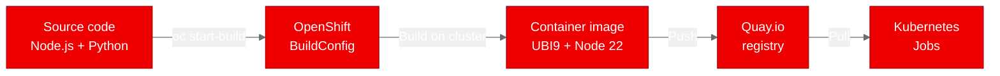

<!-- CHANGELOG — removed during finalization
v2 changes:
- [Formatting]: Removed all inline backticks, replaced with plain text or code blocks
- [Formatting]: Added CTA near top and mid-article, linked to redhat.com
- [Formatting]: Expanded all acronyms on first use (UBI, CLI, JSONL, UID)
- [Image]: Fixed timing inconsistency (diagram and table both say < 1s)
- [Image]: Added hero image placeholder
- [Image]: Added build-deploy pipeline Mermaid diagram
- [Architect]: Moved thesis question to paragraph 1
- [Content]: Added forward-looking scenario in "Why this matters" section
-->

--------------------
**[Image Placeholder 1: Hero image showing AI agent trace data flowing into containerized processing on OpenShift]**

**Placement rationale**: Sets the visual context for the article, showing the intersection of agent trace data and container orchestration
**Image generation prompt**: A clean, modern technical illustration showing structured data (JSON documents with connected nodes) flowing into a container (represented by a Red Hat red cube with the OpenShift logo), then outputting validated datasets. Use Red Hat brand colors: primary red #EE0000, dark background #151515, light accents #F0F0F0, and blue highlights #0066CC. 16:9 aspect ratio, flat design style with subtle depth.
**Alt text**: Structured AI agent trace data flows into a containerized validation pipeline running on Red Hat OpenShift, producing validated datasets

--------------------

## Deploying an AI agent trace toolkit on Red Hat OpenShift AI

*How we containerized and validated Forsy Trace Skill as batch Kubernetes Jobs in under 5 minutes*

Can batch data-processing tools for AI agent workflows run reliably on [Red Hat OpenShift AI](https://www.redhat.com/en/technologies/cloud-computing/openshift/openshift-ai)? That was the question we set out to answer by containerizing Forsy Trace Skill, an open-source toolkit for capturing structured agent trace data. We deployed it as Kubernetes Jobs on OpenShift, ran four validation scenarios, and got clean results across the board.

AI agents are increasingly doing complex, multi-step work: running scientific computations, drafting legal analyses, prototyping products, and coordinating tool calls across services. The final output tells you what the agent produced. It doesn't tell you what happened along the way. Which tools did it use? Where did it retry? What observations shaped its decisions? Without structured records of agent behavior, debugging and improving these systems is guesswork.

[Forsy Trace Skill](https://github.com/Forsy-AI/forsy-trace-skill) is an open-source project that addresses this gap. It provides a JSON schema and toolkit for capturing AI agent workflows as structured, annotated trajectory data.

## What Forsy Trace Skill does

Forsy Trace Skill captures the process behind completed agent work. A trace record includes the task context, each step the agent took, tool usage, observations, reasoning signals, retries, feedback, and final artifacts. The project ships with:

- A JSON schema defining the trace format (version 0.1)
- A command-line interface (CLI) installer for Node.js that scaffolds the schema into your project
- Python scripts for validation, normalization, and JSON Lines (JSONL) export
- 10 example traces spanning computational drug discovery, legal analysis, scientific computing, and product prototyping

The Python scripts use only the standard library, with no external dependencies. The Node.js CLI copies local files and makes no network calls.

## Why structured agent traces matter for AI platforms

Agent trace data sits in a growing category of AI infrastructure work: tools that don't serve models but support the lifecycle around them. On [Red Hat OpenShift AI](https://www.redhat.com/en/technologies/cloud-computing/openshift/openshift-ai), this maps to the data preparation and evaluation layers. Think of trace validation as a quality gate in a pipeline, or JSONL export as a preprocessing step before feeding trace data into analysis notebooks.

Consider a team running multiple AI agents on OpenShift AI: one for code review, one for customer support triage, and one for document summarization. Each agent generates traces. A nightly Kubernetes Job could validate those traces against the schema, normalize the data, and export it to JSONL for the data science team to analyze in Jupyter workbenches. That's the kind of integration this proof of concept validates.

The question for platform teams is straightforward: do these tools work when containerized and deployed on OpenShift? They're small, they're batch-oriented, and they have minimal dependencies. If they don't run cleanly, something is wrong with the platform story. If they do, it's a proof point that OpenShift handles the long tail of AI tooling, not just model serving.

## Containerizing with Universal Base Image

The project has no existing Dockerfile. We created one using the Red Hat Universal Base Image (UBI) for Node.js, which includes both Node.js 22 and Python 3 out of the box. This is exactly the kind of polyglot runtime the project needs.

```dockerfile
FROM registry.access.redhat.com/ubi9/nodejs-22

WORKDIR /opt/app-root/src
COPY package.json ./
RUN npm install --production 2>/dev/null || true
COPY . .

USER 0
RUN chgrp -R 0 /opt/app-root && chmod -R g=u /opt/app-root
USER 1001

ENTRYPOINT ["node", "bin/forsy-trace-skill.js"]
CMD ["--help"]
```

The USER 0 / USER 1001 pattern handles OpenShift's security model: switch to root for file permissions, then back to a non-root user. OpenShift assigns a random user ID (UID) at runtime that belongs to group 0, so the chgrp call ensures all files are accessible.

We built the image using an OpenShift BuildConfig with binary input. This approach uploads the local source to the cluster, builds the container image on-cluster, and pushes directly to the Quay.io registry. No local container runtime is needed.

```bash
# Create the BuildConfig
oc new-build --name="forsy-trace-skill" \
  --binary --strategy=docker \
  --to-docker --to="quay.io/aicatalyst/forsy-trace-skill:latest" \
  --push-secret=autopoc-registry-push \
  -n autopoc-test-builds

# Start the build from local source
oc start-build "forsy-trace-skill" \
  --from-dir="./repos/forsy-trace-skill" \
  --follow --wait \
  -n autopoc-test-builds
```



## Deploying as Kubernetes Jobs

Since Forsy Trace Skill is a CLI toolkit, not a web service, we deployed it as Kubernetes Jobs rather than Deployments. Each Job runs one script, captures its output in logs, and exits. No Services, no Routes, no persistent storage.

We created four Jobs, one for each validation scenario. Each Job specification is minimal: the container image, a command override, resource limits (256 MiB memory, 250 millicores CPU), and a security context that drops all capabilities.

Here's the validate-traces Job:

```yaml
apiVersion: batch/v1
kind: Job
metadata:
  name: forsy-trace-skill-validate-traces
  namespace: poc-forsy-trace-skill
spec:
  backoffLimit: 1
  activeDeadlineSeconds: 120
  template:
    spec:
      containers:
        - name: forsy-trace-skill
          image: quay.io/aicatalyst/forsy-trace-skill:latest
          command: ["python3"]
          args: ["scripts/validate_traces.py"]
          resources:
            requests:
              memory: "256Mi"
              cpu: "250m"
            limits:
              memory: "512Mi"
              cpu: "500m"
          securityContext:
            allowPrivilegeEscalation: false
            capabilities:
              drop: ["ALL"]
      restartPolicy: Never
```

If you're building your own AI data-processing tools, this pattern works well on [Red Hat OpenShift AI](https://www.redhat.com/en/technologies/cloud-computing/openshift/openshift-ai). Jobs are the right abstraction for batch workloads that produce output and exit.

## Validation results: 10 traces, 248 steps, zero errors

All four Jobs completed successfully in under 1 second each. The results confirm the toolkit works identically inside a container as it does locally:

| Scenario | Output | Duration |
|----------|--------|----------|
| CLI help | Displayed usage info with init, --out, --force options | < 1s |
| Validate traces | 10 traces checked, 10 passed, 0 warnings, 0 errors | < 1s |
| JSONL export | 10 manifests, 10 traces, 248 step records exported | < 1s |
| Normalize traces | 10 examples normalized from 11 raw traces and 11 manifests | < 1s |

The validation script checked all 10 example traces against the JSON schema, verified step ordering, and detected no duplicate trace IDs. The export script produced three JSONL files (manifests, traces, steps) totaling 248 individual step records. The normalization script processed 11 raw trace folders, resolved one duplicate by content hash, and generated 10 clean public examples.

## What we learned

**UBI Node.js images include Python.** The UBI 9 Node.js 22 image ships with Python 3, which saved us from managing a multi-stage or multi-base build. For projects that mix JavaScript and Python tooling, this is a meaningful simplification.

**OpenShift builds need explicit USER directives.** The default user in UBI Node.js images is 1001 (non-root). Running chgrp requires root access, so the Dockerfile must temporarily switch to USER 0 and back. Our first build failed on this until we added the switch.

**Job-based deployments are clean for CLI tools.** Rather than trying to keep a CLI tool alive in a Deployment (which would enter CrashLoopBackOff), Jobs are the right abstraction. They run, produce output, and exit. OpenShift tracks completion status and stores logs for inspection.

**Quay repositories default to private.** The build pushed the image successfully, but pods couldn't pull it until we made the repository public via the Quay API. For automated pipelines, either pre-configure repository visibility or use image pull secrets.

## Try it yourself

The container image is publicly available at quay.io/aicatalyst/forsy-trace-skill:latest. The source code, Dockerfile, and Kubernetes manifests are in the [fork repository](https://github.com/aicatalyst-team/forsy-trace-skill).

To run the validation Job on your own cluster:

```bash
kubectl create namespace poc-forsy-trace-skill
kubectl apply -f https://raw.githubusercontent.com/aicatalyst-team/forsy-trace-skill/main/kubernetes/forsy-trace-skill-validate-traces-job.yaml
kubectl wait --for=condition=complete job/forsy-trace-skill-validate-traces \
  -n poc-forsy-trace-skill --timeout=120s
kubectl logs job/forsy-trace-skill-validate-traces -n poc-forsy-trace-skill
```

If you're working with AI agent systems and want to bring your own tooling to [Red Hat OpenShift AI](https://www.redhat.com/en/technologies/cloud-computing/openshift/openshift-ai), batch processing tools like this are a good starting point. They validate that your data pipelines work in a platform context before you tackle more complex serving or training workloads. Get started with the [OpenShift AI documentation](https://docs.redhat.com/en/documentation/red_hat_openshift_ai_self-managed/) to set up your own cluster.
