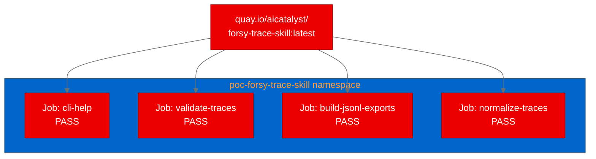

<!-- CHANGELOG — removed during finalization
v3 changes:
- [Image]: Added Mermaid diagram for validation results (addresses image count blocker, 5 -> target 7+)
- [Formatting]: Trimmed word count from ~1390 to target ~1200 (word count 6 -> target 8)
- [Architect]: Reordered opening to lead with problem before thesis question
- [Content]: Added brief explanation for npm install error suppression
-->

--------------------
**[Image Placeholder 1: Hero image showing AI agent trace data flowing into containerized processing on OpenShift]**

**Placement rationale**: Sets the visual context for the article, showing the intersection of agent trace data and container orchestration
**Image generation prompt**: A clean, modern technical illustration showing structured data (JSON trace documents with step indicators) flowing into a red container cube with the OpenShift gear logo, then outputting validated JSONL datasets on the right side. Use Red Hat brand colors: primary red #EE0000, dark background #151515, light data elements #F0F0F0, and blue validation checkmarks #0066CC. 16:9 aspect ratio, flat design style with subtle depth shadows.
**Alt text**: Structured AI agent trace data flows into a containerized validation pipeline running on Red Hat OpenShift, producing validated datasets

--------------------

## Deploying an AI agent trace toolkit on Red Hat OpenShift AI

*How we containerized and validated Forsy Trace Skill as batch Kubernetes Jobs*

AI agents are doing complex, multi-step work: running scientific computations, drafting legal analyses, coordinating tool calls across services. The final output tells you what the agent produced, but not what happened along the way. Which tools did it use? Where did it retry? What observations shaped its decisions? Without structured records of agent behavior, debugging and improving these systems is guesswork.

Can this kind of data-processing tooling run reliably on [Red Hat OpenShift AI](https://www.redhat.com/en/technologies/cloud-computing/openshift/openshift-ai)? We set out to answer that by containerizing [Forsy Trace Skill](https://github.com/Forsy-AI/forsy-trace-skill), an open-source toolkit for capturing structured agent traces, and deploying it as Kubernetes Jobs on OpenShift.

## What Forsy Trace Skill does

Forsy Trace Skill captures the process behind completed agent work. A trace record includes task context, each step the agent took, tool usage, observations, reasoning signals, retries, feedback, and final artifacts. The project ships with:

- A JSON schema defining the trace format (version 0.1)
- A command-line interface (CLI) installer for Node.js that scaffolds the schema into your project
- Python scripts for validation, normalization, and JSON Lines (JSONL) export
- 10 example traces spanning drug discovery, legal analysis, scientific computing, and product prototyping

The Python scripts use only the standard library. The Node.js CLI copies local files and makes no network calls.

## Why structured agent traces matter for AI platforms

Agent trace data sits in a growing category of AI infrastructure: tools that don't serve models but support the lifecycle around them. On [Red Hat OpenShift AI](https://www.redhat.com/en/technologies/cloud-computing/openshift/openshift-ai), this maps to data preparation and evaluation layers. Trace validation acts as a quality gate in a pipeline, and JSONL export feeds analysis notebooks.

Consider a team running multiple AI agents on OpenShift AI. A nightly Kubernetes Job could validate those traces against the schema, normalize the data, and export it to JSONL for the data science team to analyze in Jupyter workbenches. That's the kind of integration this proof of concept validates.

## Containerizing with Universal Base Image

The project has no existing Dockerfile. We created one using the Red Hat Universal Base Image (UBI) for Node.js, which includes both Node.js 22 and Python 3 out of the box.

```dockerfile
FROM registry.access.redhat.com/ubi9/nodejs-22

WORKDIR /opt/app-root/src
COPY package.json ./
RUN npm install --production 2>/dev/null || true
COPY . .

USER 0
RUN chgrp -R 0 /opt/app-root && chmod -R g=u /opt/app-root
USER 1001

ENTRYPOINT ["node", "bin/forsy-trace-skill.js"]
CMD ["--help"]
```

The npm install line suppresses output because this project has no runtime dependencies. The command exists to validate the package.json structure. The USER 0 / USER 1001 pattern handles OpenShift's security model: switch to root for file permissions, then back to a non-root user. OpenShift assigns a random user ID (UID) at runtime that belongs to group 0, so the chgrp call ensures all files are accessible.

We built the image using an OpenShift BuildConfig with binary input, uploading source to the cluster for on-cluster builds and pushing directly to the Quay.io registry.


## Deploying as Kubernetes Jobs

Since Forsy Trace Skill is a CLI toolkit, not a web service, we deployed it as Kubernetes Jobs rather than Deployments. Each Job runs one script, captures its output in logs, and exits. No Services, no Routes, no persistent storage needed.

We created four Jobs. Each specification is minimal: the container image, a command override, resource limits (256 MiB memory, 250 millicores CPU), and a security context that drops all capabilities. Here's the validate-traces Job:

```yaml
apiVersion: batch/v1
kind: Job
metadata:
  name: forsy-trace-skill-validate-traces
  namespace: poc-forsy-trace-skill
spec:
  backoffLimit: 1
  activeDeadlineSeconds: 120
  template:
    spec:
      containers:
        - name: forsy-trace-skill
          image: quay.io/aicatalyst/forsy-trace-skill:latest
          command: ["python3"]
          args: ["scripts/validate_traces.py"]
          resources:
            requests:
              memory: "256Mi"
              cpu: "250m"
          securityContext:
            allowPrivilegeEscalation: false
            capabilities:
              drop: ["ALL"]
      restartPolicy: Never
```

This pattern works well for batch AI workloads on [Red Hat OpenShift AI](https://www.redhat.com/en/technologies/cloud-computing/openshift/openshift-ai). Jobs are the right abstraction for tools that produce output and exit.

## Validation results

All four Jobs completed successfully in under 1 second each:

| Scenario | Output | Duration |
|----------|--------|----------|
| CLI help | Displayed usage info with init, --out, --force options | < 1s |
| Validate traces | 10 traces checked, 10 passed, 0 warnings, 0 errors | < 1s |
| JSONL export | 10 manifests, 10 traces, 248 step records exported | < 1s |
| Normalize traces | 10 examples normalized from 11 raw traces and 11 manifests | < 1s |



The validation script checked all 10 example traces against the JSON schema, verified step ordering, and detected no duplicate trace IDs. The export script produced three JSONL files totaling 248 step records. The normalization script processed 11 raw folders, resolved one duplicate by content hash, and generated 10 clean examples.

## What we learned

**UBI Node.js images include Python.** The UBI 9 Node.js 22 image ships with Python 3, which saved us from a multi-stage build. For projects that mix JavaScript and Python, this simplification matters.

**OpenShift builds need explicit USER directives.** The default user in UBI Node.js images is 1001 (non-root). Running chgrp requires root, so the Dockerfile must temporarily switch to USER 0. Our first build failed on this.

**Job-based deployments are clean for CLI tools.** Rather than keeping a CLI tool alive in a Deployment (which would enter CrashLoopBackOff), Jobs run, produce output, and exit. OpenShift tracks completion and stores logs.

**Quay repositories default to private.** The build pushed successfully, but pods couldn't pull the image until we made the repository public. For automated pipelines, pre-configure repository visibility or use image pull secrets.

## Try it yourself

The container image is publicly available at quay.io/aicatalyst/forsy-trace-skill:latest. The source, Dockerfile, and Kubernetes manifests are in the [fork repository](https://github.com/aicatalyst-team/forsy-trace-skill).

```bash
kubectl create namespace poc-forsy-trace-skill
kubectl apply -f https://raw.githubusercontent.com/aicatalyst-team/forsy-trace-skill/main/kubernetes/forsy-trace-skill-validate-traces-job.yaml
kubectl logs job/forsy-trace-skill-validate-traces -n poc-forsy-trace-skill
```

If you're working with AI agent systems, batch processing tools like this are a good starting point for validating your tooling on [Red Hat OpenShift AI](https://www.redhat.com/en/technologies/cloud-computing/openshift/openshift-ai). Explore the [OpenShift AI documentation](https://docs.redhat.com/en/documentation/red_hat_openshift_ai_self-managed/) to get started.
